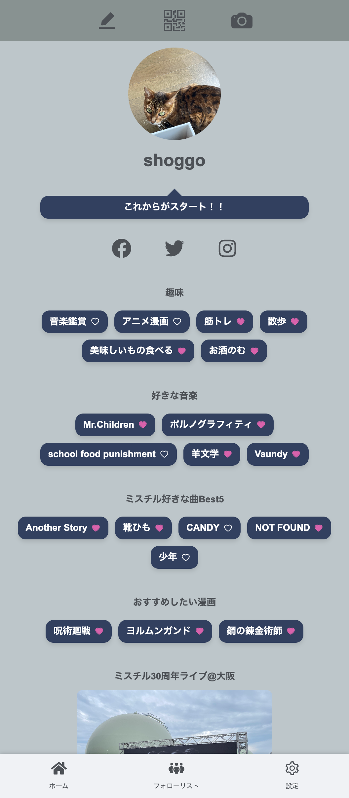

# 自己紹介Webサービス LINKARD

## 概要

LINKARDはモバイル対応の自己紹介Webサービスです。フロントエンドには、React(Vite)を使用し、バックエンドにはLaravel（API）を使用、DBはMySQLを用いています。
Vercelにでぷお

## デモ

以下のGIFは、このアプリのデモンストレーションです。

## スクリーンショット

以下は、アプリのいくつかのスクリーンショットです。

## 機能

- 新規登録、ログイン、ログアウト
- プロフィールの作成、表示、編集、削除
- いいね
- フォロー
- フォロー時のグルーピング機能

## 特徴

- bearer tokenを用いた認証
- 動的な入力フォーム
- QRコードスキャンによるフォローページへの遷移
- QRコードを使用したフォロー機能
- フォロー時のグルーピング機能
- アイデンティティをだすため、プロフィールカードのテーマ色設定機能

## 使用技術

- React: ^18.2.0
- Vite: ^4.4.5
- Laravel (backend)
- antd: ^5.9.2
- react-webcam: ^7.1.1
- その他多数

